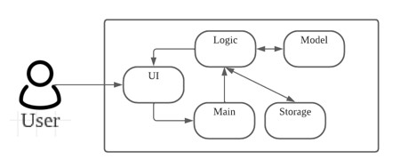

# User Guide
  ```
Welcome to 
   _____ _____ _____   ____              _                           
  / ____|_   _/ ____| |  _ \            | |        __                
 | |  __  | || |      | |_) | __ _ _ __ | | __    /  \   _ __  _ __  
 | | |_ | | || |      |  _ < / _` | '_ \| |/ /   / /\ \ | '_ \| '_ \ 
 | |__| |_| || |____  | |_) | (_| | | | |   <   / ____ \| |_) | |_) |
  \_____|_____\_____| |____/ \__,_|_| |_|_|\_\ /_/    \_\ .__/| .__/ 
                                                        | |   | |    
                                                        |_|   |_|    
What would you like to do today?
```
GIC Bank App is a simple banking system that handles operations on bank accounts.

* [Quick Start](#quick-start)
* [Features](#Features)
* [System Design](#system-design)
* [Assumptions](#assumptions)
    + [1. Depositing into account: `d`](#1-depositing-into-account-d)
    + [2. Withdrawing from account: `w`](#2-withdrawing-from-account-w)
    + [3. Printing bank statements: `p`](#3-printing-bank-statements-p)
    + [4. Exiting the program: `q`](#4-exiting-the-program-q)
    + [5. Listing available help: `h`](#5-listing-available-help-h)
* [Command Summary](#command-summary)

## Quick Start
1. Ensure that you have Java `11` or above installed in your computer.
2. Import .zip file and open as IntelliJ project
3. Click run or use Shift + F10 shortcut
4. Use the application accordingly

## System Design
The architecture diagram given in the figure below explains the high-level design of the banking application.


Given below is a quick overview of each component.

`Main` is the class GicBankApp.java. It is responsible for:

- Initializing the components in the correct sequence

The rest of the App consists of 4 main components:

- `Ui` : The Ui component handles all interactions with the user.
- `Logic` : The Logic component processes the command and executes it.
- `Model` : The Model component is responsible POJO classes for the classes needed.
- `Storage` : The Storage component handles data by reading from and writing to files. 

## Assumptions
1. Users are familiar with the command line interface
2. Users are already logged into their account (No sign-in required in the application)
3. Storage files are not accessible by users.

### 1. Depositing into account: ```d```
Deposit an amount into specified bank account <br>
Format: <code>d</code> then enter amount when prompted <br>
Example of usage: <code>d</code><br>
Upon prompt: <code>100.01</code><br>
Expected outcome: 
```
$100.01 has been deposited to your account
Is there anything else you'd like to do?
Here is the range of commands:
1.  [D]eposit : Place money into bank account 
2.  [W]ithdraw: Take out money from bank account
3.  [P]rint Statement: Display bank statements ordered by date
4.  [Q]uit: Exit Program
```

### 2. Withdrawing from account: ```w```

>Note: User input must only contain numbers and one decimal point. Account balance must also be sufficient for a successful withdrawal.

Withdraw an amount from specified bank account <br>
Format: <code>w</code> then enter amount when prompted <br>
Example of usage: <code>w</code><br>
Upon prompt: <code>50.123</code><br>
Expected outcome: 
```
$50.12 has been withdrawn
Is there anything else you'd like to do?
Here is the range of commands:
1.  [D]eposit : Place money into bank account 
2.  [W]ithdraw: Take out money from bank account
3.  [P]rint Statement: Display bank statements ordered by date
4.  [Q]uit: Exit Program
```

### 3. Printing bank statements: ```p```
Print all existing bank statements <br>
Format: <code>p</code><br>
Example of usage: <code>p</code><br>
Expected outcome: 
```
Date                      |       Amount     |    Balance
19 Aug 2022 00:54:11:AM   |      1590.00     |    1590.00
19 Aug 2022 00:54:22:AM   |      -590.00     |    1000.00
19 Aug 2022 00:54:33:AM   |       123.32     |    1123.32
19 Aug 2022 00:55:17:AM   |      1239.20     |    2362.52
19 Aug 2022 01:05:37:AM   |       100.00     |    2462.52
```

### 4. Exiting the program: ```q```
Exits the program, triggering automatic saving of data <br>
Example of usage: <code>q</code> <br>
Expected outcome:
```
Thank you for banking with Bank of GIC.
Have a great day ahead!
```

### 5. Listing available help: ```h```
Lists a set of commands available to users <br>
Example of usage: <code>h</code> <br>
Expected outcome:
```
Here is the range of commands:
1.  [D]eposit : Place money into bank account 
2.  [W]ithdraw: Take out money from bank account
3.  [P]rint Statement: Display bank statements ordered by date
4.  [Q]uit: Exit Program
```

Command | Format | Example
--- | --- | ---
d | `d` **amount** | `d` **100.23**
w | `w` **amount** | `w` **99.56**
p | `p` | `p`
h | `h` | `h`
q | `q` | `q`
